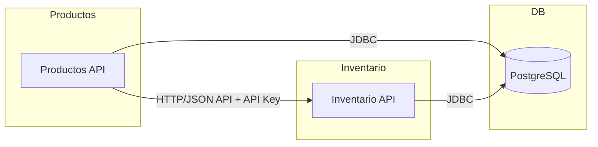

# linktic-prueba

Este proyecto resuelve la prueba técnica para desarrollador backend en Linktic.  
Está compuesto por dos microservicios independientes: **Inventario** y **Productos**, desarrollados con Spring Boot y Maven multimódulo.

## Estructura del proyecto

```
linktic-prueba/
│
├── inventario-services/      # Microservicio para gestión de inventario
│
├── productos-services/       # Microservicio para gestión de productos
│
├── pom.xml                   # Proyecto padre (multimódulo)
└── compose.yaml              # Configuración Docker Compose (opcional)
```

## Tecnologías principales

- Java 17
- Spring Boot 3.5.5
- Maven multimódulo
- PostgreSQL
- Docker Compose (opcional)
- Lombok

## Cómo ejecutar

1. **Compilar todo el proyecto:**
   ```sh
   mvn clean install
   ```

2. **Ejecutar un microservicio:**
   ```sh
   cd inventario-services
   mvn spring-boot:run
   ```
   o
   ```sh
   cd productos-services
   mvn spring-boot:run
   ```

3. **(Opcional) Ejecutar con Docker Compose:**
   ```sh
   docker compose up
   ```

## Configuración

Cada microservicio tiene su propio archivo `application.properties` en `src/main/resources` para configurar base de datos, puerto, etc.

## Pruebas

Ejecuta las pruebas unitarias con:
```sh
mvn test
```

## Arquitectura



## Autenticación entre microservicios

Las llamadas entre servicios requieren una API Key en el header:  
`X-API-KEY: <tu_api_key>`

Configura la API Key en los archivos `application.properties` y como variable de entorno en Docker.

## Logs estructurados

Ambos servicios usan SLF4J para logs estructurados. Los eventos de inventario se registran en consola.
